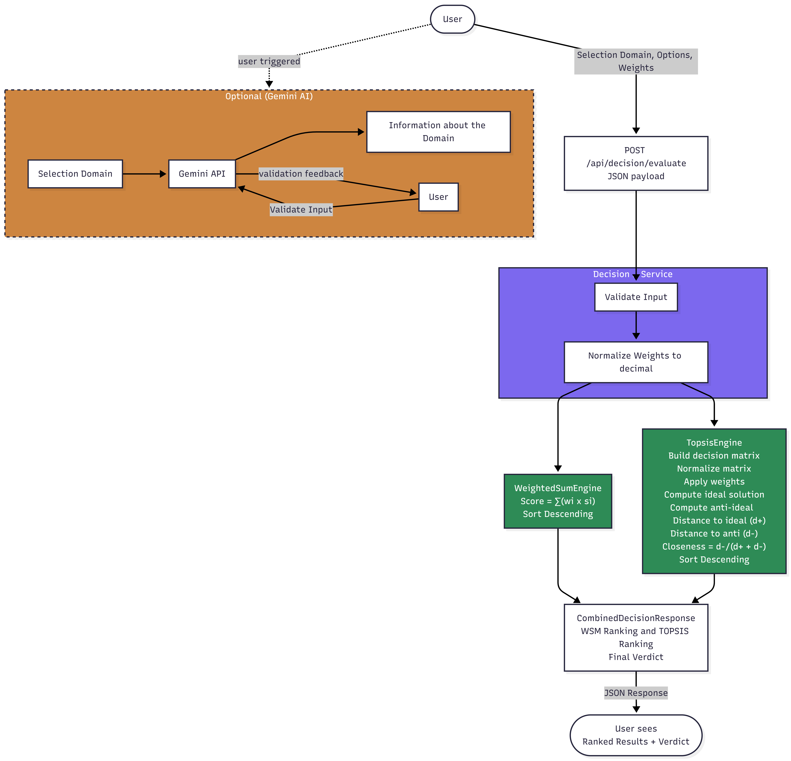

# Decision Companion System

## Overview

The **Decision Companion System** is a web-based tool that helps users make better decisions by evaluating multiple options against weighted criteria. The system provides ranked recommendations with full explanations of why a particular option is preferred.

The system is built around **Multi-Criteria Decision Making (MCDM)** — specifically **Weighted Sum Model (WSM)** and **TOPSIS** — rather than relying entirely on AI. Every score is traceable, every ranking is explainable, and the user retains full control over inputs and weights.

---

## Understanding the Problem

Real-world decisions are hard because:
- Multiple options exist with no single clear winner
- Different criteria matter to different people
- Trade-offs between criteria are not always obvious

This system solves that by letting the user define what matters (criteria), how much it matters (weights), and how each option performs (scores) — then running two independent algorithms to produce a ranked, explainable result.

---

## Assumptions

- All scores are entered by the user on a **1–10 scale**. Rate each criterion from 1 (lowest) to 10 (highest). A higher score means better for **your** goal. You decide what best means — if you prefer low cost, rate the cheapest option a 10. If you prefer premium quality, rate the most expensive a 10. There is no universal right answer — only what matters to you.
- The interpretation of each metric is left entirely to the user — the system does not assume what "better" means for any given criterion
- Weights must sum to exactly **100%**
- All candidates must have the **same set of metrics**
- The system is **stateless** — no data is stored between sessions

---

## Technology Stack

| Component | Technology |
|---|---|
| Language | Java 21 |
| Framework | Spring Boot 3.2.5 |
| Build Tool | Gradle |
| Frontend | HTML + CSS + Vanilla JS |
| JSON Handling | Jackson (via Spring Boot) |
| Test Framework | JUnit Jupiter |
| IDE | Visual Studio Code |
| Version Control | Git |

---

## Project Structure

```
Decision_Companion_System/
├── app/
│   └── src/
│       ├── main/
│       │   ├── java/org/example/
│       │   │   ├── controller/
│       │   │   │   └── DecisionController.java
│       │   │   ├── service/
│       │   │   │   └── DecisionService.java
│       │   │   ├── engine/
│       │   │   │   ├── DecisionEngine.java
│       │   │   │   ├── WeightedSumEngine.java
│       │   │   │   └── TopsisEngine.java
│       │   │   ├── domain/
│       │   │   │   ├── Criterion.java
│       │   │   │   ├── Option.java
│       │   │   │   ├── DecisionRequest.java
│       │   │   │   ├── DecisionResult.java
│       │   │   │   └── CombinedDecisionResponse.java
│       │   │   └── DecisionCompanionApplication.java
│       │   └── resources/
│       │       ├── static/
│       │       │   └── index.html
│       │       └── application.properties
│       └── test/
│           └── java/org/example/
├── build.gradle
├── settings.gradle
├── README.md
├── BUILD_PROCESS.md
├── RESEARCH_LOG.md
└── screenshots/
    ├── DFD.png
```

---

## How It Works

### User Flow

```
Step 1 → Enter decision category 
Step 2 → Add candidates and score each metric from 1-10
Step 3 → Assign weights to each metric (must sum to 100%)
Step 4 → Click Evaluate
Step 5 → View WSM and TOPSIS rankings + final verdict
```

### Algorithms

**Weighted Sum Model (WSM)**
- For each option: `Score = Σ (weight_i × score_i)`
- Simple, transparent, fully explainable
- Winner = option with highest total score

**TOPSIS (Technique for Order Preference by Similarity to Ideal Solution)**
- Normalizes the decision matrix
- Applies weights
- Finds the ideal solution (best per criterion) and anti-ideal (worst per criterion)
- Ranks options by closeness ratio: `C = d⁻ / (d⁺ + d⁻)`
- Winner = option closest to ideal and farthest from worst

### Final Verdict

```
"Your ideal {category} would be {TOPSIS winner}"
"{WSM winner} shows the most value"
```

Both verdicts are shown together — giving the user two independent perspectives.

---

## Data Flow Diagram



---

## Known Constraints

| Constraint | Explanation |
|---|---|
| Criteria independence assumed | WSM and TOPSIS assume metrics don't influence each other. In reality they often do (e.g. performance and price in laptops). This is a known mathematical limitation. |
| Scores are subjective | Two users rating the same option may score differently. This is by design — the system is a personal decision aid, not an objective ranker. |
| No consistency check | The system trusts user scores without verifying internal consistency. AHP addresses this but is out of scope. |
| No disqualification logic | An option cannot be eliminated outright regardless of scores. All options are always ranked. |

---
## Known Issues

- **Gradle 9.3.1 incompatibility** — Gradle 9.3.1 is incompatible with Spring Boot 3.2.5 due to a configuration cache serialization error (`DefaultLegacyConfiguration`). The project uses **Gradle 8.7** as a workaround. Gradle 9.x is not supported.

---

## How to Run

### Prerequisites
- Java 21+
- Gradle (or use the included `./gradlew` wrapper)

### Steps

```bash
# Clone the repository
git clone https://github.com/abhi-pillai/Decision_Companion_System.git
cd Decision_Companion_System
# Run the application
./gradlew bootRun
```


## What I Would Improve With More Time

- **AI Advisory Module** — Integrate Gemini API to explain metrics and validate user input before evaluation
- **Raw value normalization mode** — Let users enter actual values (price in rupees, battery in hours) and auto-normalize using min-max for quantitative metrics
- **Qualitative metric dropdowns** — Replace free-text scoring for qualitative metrics with dropdowns (Poor / Average / Good / Excellent) that map to numbers internally
- **Weight slider UI** — Live weight adjustment with real-time sum validation
- **Sensitivity analysis** — Show how the ranking changes if weights shift slightly
- **Export results** — Allow users to download results as PDF or CSV
- **Session history** — Optional local storage of past decisions for reference


## References
- [RESEARCH_LOG.md](RESEARCH_LOG.md) — full log of AI prompts, searches, and references used
- [BUILD_PROCESS.md](BUILD_PROCESS.md) — full build history and design evolution